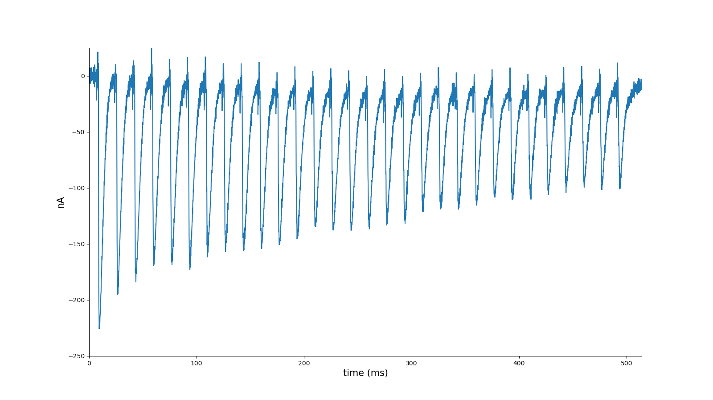
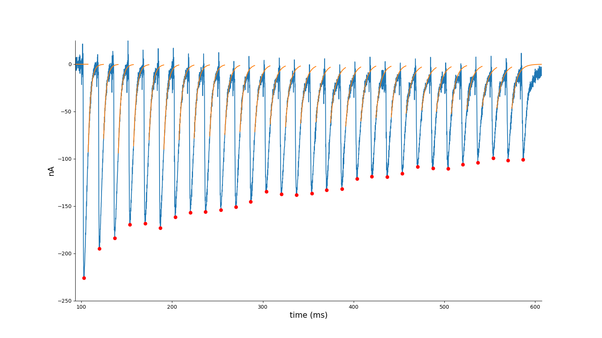
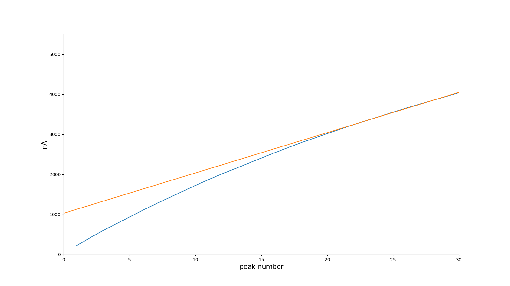

# High frequency train readily releasable pool analysis (hfrp)

`hfrp` is a Python library designed for automatically analyzing high-frequency train stimulation for releasable pool analysis. It reads electrophysiology data from Axon Binary Format (ABF) files. The library was created with the goal of providing an automatic and robust analysis with minimal human intervention. It can be easily configured to run as a job, processing ABF files automatically.

The code will fit an exponential function $ae^{-bt}$ to each peak's decaying phase, utilizing the portion from 5% to 50% of the peak value, and subtract the contribution of this exponential function from all subsequent stimulations.

## Installation

`hfrp` does not need installation. Just download `hfrp.py`. To install dependency, run

```bash
pip install -r requirements.txt
```

## Quickstart

To process a directory, run:

```bash
python hfrp.py directory_name
```

The code will process all ABF files in `directory_name`, create a new folder named results under directory_name, generate `results.csv` file to include all statistics from the analysis for all files in `directory_name`, and produce the following files for each trace and each sweep:

```
{filename}_{sweepnumber}_trace.svg, # displays the selected trace for analysis
{filename}_{sweepnumber}_fit.svg,   # displays the exponentially fitted trace with the identified peaks
{filename}_{sweepnumber}_cum.svg,   # shows the cumulative sum of peaks with the intercept
```







To process a single ABF file, run:

```bash
python hfrp.py file_name
```

This will create a new folder named `results` in the same directory as `file_name`, generate `results.csv` file to include all statistics from the analysis for all sweeps, and produce the same files for each sweep in `file_name`.


## Use `hfrp` in code

To use `hfrp` in Python code, do

```
from hfrp import HFRP

hfrpo = HFRP({file_path})

res = hfrpo.proc_trace()
```

To process a particular sweep `i`, run

```
res = hfrpo.proc_single_trace(i)
```

## Options for analysis

The default options should work well for most traces. However, if customized figures or analysis are needed, `HFRP` supports the following options for analysis.

```
lowpass_f=400,          # low pass filter cutoff frequency
scaling_factor=1,       # trace amplitude scaling factor
trough_max_amp=-20,     # trough maximum amplitude
init_min_amp=-40,       # the first peak minimum amplitude 
trough_window=80,       # window size to determine trough
peak_window=8,          # window size to determine peak
min_peak_trough_gap=10, # minimum peak and trough distance
max_peaks_keep=30,      # maximum peaks to keep
intercept_window=10,    # number of peaks to determine intercept
plot_figure=True,       # generate figures
plot_label_size=15,     # label font size in plot
use_exp_fit=True,       # use exponential fit to determine peak
save_res=False,         # save results in csv for this trace
fix_baseline=True,      # find baseline using the median signal before the first peak
fig_extension="svg",    # figure extension
show_fig_box=True,      # show figure bounding box
```

## Reference

Tingting Wang and C. Andrew Frank, Measuring the Readily Releasable Synaptic Vesicle Pool at the Drosophila Larval Neuromuscular Junction, Cold Spring Harb Protoc; doi:10.1101/pdb.prot108425

## Support and Contribution
If you encounter any bugs while using the code, please don't hesitate to create an issue on GitHub here.